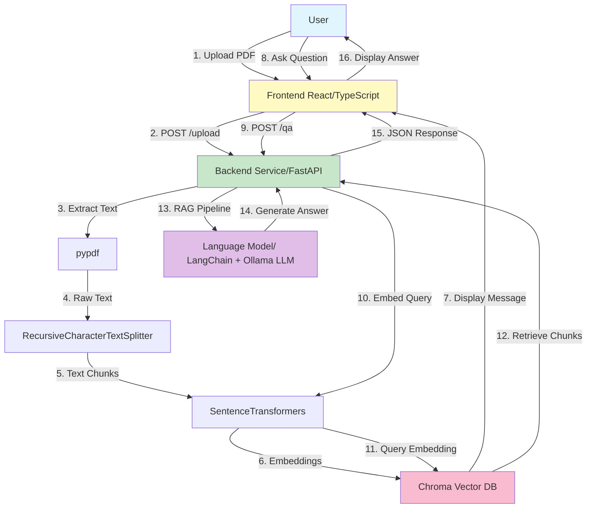

# ComplianceCopilot

An AI-powered application for processing and querying compliance documents. ComplianceCopilot uses local language models and vector embeddings to enable intelligent document retrieval and question-answering on compliance materials.

## Project Overview

ComplianceCopilot is a full-stack application consisting of a Python FastAPI backend and a React TypeScript frontend. It allows users to upload compliance documents (PDFs), process them through an AI pipeline, and ask natural language questions about their content.

## Backend

The backend is built with **FastAPI** and provides REST APIs for document processing and querying.

### Technology Stack

- **Framework**: FastAPI 0.135.3
- **LLM Integration**: LangChain 1.2.15 with Ollama (local inference)
- **Vector Database**: Chroma 1.1.0 for semantic search
- **Embeddings**: Sentence Transformers 5.4.0
- **Document Processing**: pypdf 6.10.0 for PDF extraction
- **Server**: Uvicorn 0.44.0

### Key Features

- PDF document upload and processing
- Text extraction with page numbering for citations
- Semantic chunking of documents (1000 tokens with 200-token overlap)
- Vector embeddings with Chroma vector database
- RAG (Retrieval-Augmented Generation) pipeline for question answering
- CORS-enabled for frontend integration
- Audit trail logging

### API Endpoints

- `POST /upload` - Upload and process compliance documents
- `POST /ask` - Ask questions about processed documents
- Document processing endpoints with audio context creation

### Setup

```bash
cd backend
uv sync
```

### Running the Backend

```bash
cd backend
uv run main.py
```

The backend server runs on `http://localhost:8000` by default.

## Frontend

The frontend is built with **React** and **TypeScript** using **Vite** for fast development and building.

### Technology Stack

- **Framework**: React 19.2.4
- **Language**: TypeScript 6.0.2
- **Build Tool**: Vite 8.0.4
- **HTTP Client**: Axios 1.15.0
- **UI Framework**: Bootstrap 5.3.8
- **Markdown Rendering**: react-markdown 10.1.0
- **Environment**: dotenv 17.4.2
- **Linting**: ESLint with TypeScript support

### Features

- Responsive UI built with Bootstrap
- Document upload interface
- Real-time question-answering interface
- Markdown support for rendering LLM responses
- Type-safe React components with TypeScript

### Setup

```bash
cd frontend
npm install
```

### Running the Frontend

Development mode with hot module replacement (HMR):

```bash
cd frontend
npm run dev
```

The frontend runs on `http://localhost:5173` by default.

Build for production:

```bash
cd frontend
npm run build
```

### Code Quality

Run linting:

```bash
cd frontend
npm run lint
```

## Project Structure

```
ComplianceCopilot/
├── backend/
│   ├── main.py              # FastAPI application
│   ├── context_creator.py   # PDF processing and context creation
│   ├── pyproject.toml       # Python dependencies
│   ├── audit/               # Audit trail logs
│   └── chroma_db/           # Vector database storage
├── frontend/
│   ├── src/
│   │   ├── App.tsx          # Main React component
│   │   ├── main.tsx         # Entry point
│   │   └── assets/          # Static assets
│   ├── public/              # Public files
│   ├── vite.config.ts       # Vite configuration
│   ├── tsconfig.json        # TypeScript configuration
│   └── package.json         # Node dependencies
└── documents/               # User-uploaded documents
```

## Getting Started

### Prerequisites

- Python 3.10+
- Node.js 16+
- Ollama (for local LLM inference)

### Installation

1. Clone the repository
2. Install and start Ollama with your preferred model
3. Set up backend:
   ```bash
   cd backend
   uv sync
   ```
4. Set up frontend:
   ```bash
   cd frontend
   npm install
   ```

### Development

1. Start the backend:
   ```bash
   cd backend
   uv run main.py
   ```

2. Start the frontend (in a new terminal):
   ```bash
   cd frontend
   npm run dev
   ```

3. Open `http://localhost:5173` in your browser

## Building for Production

Backend: Flask/Uvicorn automatically runs in production-ready mode when deployed.

Frontend: Build and preview for production:

```bash
cd frontend
npm run build
npm run preview
```

## Architecture

The application follows a client-server architecture:

1. **Frontend** (React/TypeScript) - User interface for document upload and queries
2. **Backend** (FastAPI) - REST API for processing and retrieval
3. **Vector DB** (Chroma) - Stores document embeddings for semantic search
4. **LLM** (Ollama) - Local language model for inference

The backend uses RAG (Retrieval-Augmented Generation) to:
1. Convert user documents to text
2. Split text into meaningful chunks
3. Create embeddings for semantic search
4. Retrieve relevant chunks for user queries
5. Generate answers using the local LLM

### Data Flow Diagram


